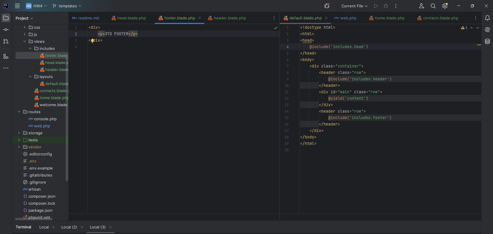

# Продвинутое программирование на PHP — Laravel
## Домашняя работа №4

# 1. Создайте новый проект Laravel или откройте уже существующий проект, в который хотите добавить шаблоны.

---

---

# 2. Создайте новую ветку вашего репозитория от корневой (main или master).

---

---

# 3. В корневом каталоге проекта создайте подкаталог resources/views. Создайте в нём два шаблона: home.blade.php и contacts.blade.php. Вы заполните эти шаблоны позже.

---

---

# 4. В файле routes/web.php создайте необходимые роуты для навигации по страницам и передачи данных:

— Первый роут — '/', ссылается на корневую страницу проекта. Route::get должен возвращать функцию view. Первым аргументом передайте шаблон home, вторым аргументом — массив данных с ключами name, age, position, address. Значения могут быть произвольными.

— Второй роут — '/contacts'', ссылается на одноимённую страницу с контактами. По аналогии с первым роутом верните из роута функцию view, передайте шаблон contacts и массив с данными — address, post_code, email, phone.

---

---

# 5. В директории views создайте подкаталог layouts, внутри которого поместите шаблон default.blade.php:

---

---

---

---

# 6. Как видно из картинки выше, вам необходимо создать переиспользуемые шаблоны для тегов <head>, <footer> и <hеader>. Для этого в папке views создайте подкаталог includes, а в ней, по аналогии уже с созданными страницами, — три соответствующих шаблона с произвольной вёрсткой и вложенностью.

---

---

# 7. Вернёмся к страницам home и contacts:

---

---

# Внутри директивы @section добавьте базовую HTML-разметку. Для каждой страницы воспользуйтесь директивой @if. Если значение age для страницы home больше 18 лет, выводите простую цифру, в противном случае — предупреждающее сообщение о том, что указанный человек слишком молод. То же самое повторите и со страницей контактов. Если вместо почты в шаблон приходит пустая строка, выведите сообщение: «Адрес электронной почты не указан».

---

---

---

---
